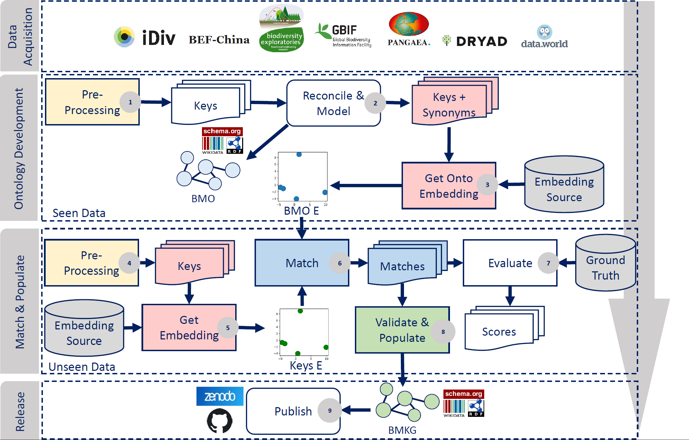
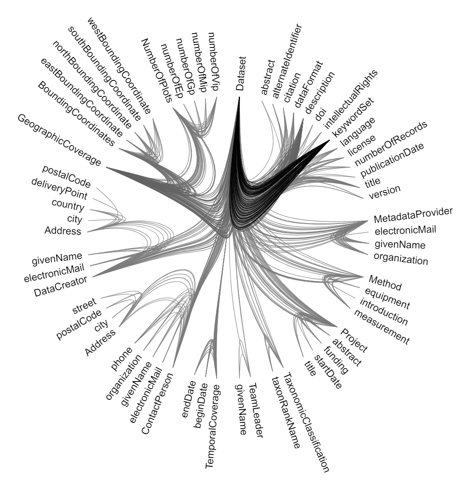

# Meta2KG
This project aims to transform metadata XML files into a knowledge graph automatically. 
Such transformation is based on embedding-based similarity.
We developed and tested our approach in the Biodiversity domain; however, our approach is not limited to it.

This repository contains the scripts we developed in our pipeline. In this file, we explain the framework then we continue how to reproduce the results.

## Workflow
The figure below shows our 4 stages workflow. 
1. **Data Acquisition**: from 7 Biodiversity data portals, we collected a set of metadata files. Such that we divided them into Seen and Unseen data.
2. **Ontology Development**: We work on the Seen Data. The goals of that stage are:
   * To develop a shared underlying schema for the 7 repos. The result is the [Biodiversity Metadata Ontology (BMO)](https://doi.org/10.5281/zenodo.6948519).
   * We used the [MakeSchema](https://github.com/fusion-jena/MakeSchema) project to create the final BMO (turtle, n-triples, and RDF/XML files) 
   * To Obtain the BMO embeddings we use for the automatic transformation in the later steps. The result is the [Biodiversity Metadata Ontology Embeddings (BMOE)](https://doi.org/10.5281/zenodo.6951658)
3. **Match & Populate**: Where we apply the cosine similarity between the BMOE and the Unseen data embeddings. In addition, we provide a validation module that ensures the validity of a KG triple. 
   * We evaluated our approach using a manually annotated ground truth: [Biodiversity Metadata Ground Truth](https://doi.org/10.5281/zenodo.6951623)
4. **Release**: We publish the final automatically generated knowledge graph in Zenodo [Biodiversity Metadata Knowledge Graph (BMKG)](https://doi.org/10.5281/zenodo.6948573).



## Quick Setup
* Download the dependencies, unzip and add them directly under the [input](input) dir:
  * [Biodiversity Metadata Ground Truth](https://doi.org/10.5281/zenodo.6951623)
  * [Biodiversity Metadata Ontology Embeddings (BMOE)](https://doi.org/10.5281/zenodo.6951658)
  * Our collected metadata files are already there.
  * `input` directory should have the following structure
```
./input
├───BMO Embeddings
│   ├───keys_only
│   ├───mean
│   └───weighted_mean
├───gt
├───meta_files
│   ├───befchina
│   ├───bexis
│   ├───dataworld
│   ├───dryad
│   ├───gbif
│   ├───idiv
│   └───pangaea
├───pre-trained-fasttext
├───trained_model
└───unseen_data
    ├───befchina
    ├───bexis
    ├───dataworld
    ├───dryad
    ├───gbif
    ├───idiv
    └───pangaea
```
* Each module has an **entry script** that executes the individual scripts of the current module. In addition, we keep the **individual results** folder per module for further analysis. 
  1. preprocessing [preprocessing/main.py](preprocessing/main.py)
  2. testing aka Match & Evaluate, [testing/main.py](testing/main.py) 
  3. KG population, [kg_population/main.py](kg_population/main.py)
4. The final KG would be located under the results folder of the kg_population module
   1. BMKG.ttl
   2. BMKG.rdf
   3. BMKG.nt

## Modules
### [Preprocessing](preprocessing)
* `flatten.py` transforms the XML files into a flat key-value pairs dictionary. a Key would contain the entire hierarchy.
* `transform_keys.py` cleans the generated flat keys of the dictionary above by, e.g., removing too broad words.

### [Custom Embeddings](custom_embeddings)
* `meta2train.py` artificially creates sentences from the clean dictionary.
* `pretrain_embeddings.py` train a fasttext model on the created sentences. 

### [Ontological Embeddings (BMOE)](ontoE)
* `group_keywords.py` since we develop a mean-based strategy to obtain embeddings for keys given their synonyms. This script is meant for catching such synonyms. This script would help figure out what is related. However, we keep the final result for human checks.
  * We picked the relevant keys on our own; we put our use case under [/assets/onto_keywords_mapping.csv](/assets/onto_keywords_mapping.csv)
* `construct_onto_embeddings.py` will process the given mappings from the step above. Make sure it is correctly listed under the `config.py`.
  * `use_wiki_embeddings=True` Will activate the pre-trained wiki-based embeddings; otherwise, it will use our custom embeddings.
  * `use_weighted_embeddings=True` Will activate the weighted mean strategy to calculate the final embedding vector; otherwise, it has the mean only effect, and no variable weights are given for the key's parts.
  * `use_keys_only=True` If true, no synonyms are processed; otherwise, it considers them.
  * Make sure to place the generated file correctly if you need to test various settings.

### [Testing Environment](testing)
* This module solves the Unseen data **per repository** since we construct evaluation metrics of the matching techniques per data source.  
* Before you start, have a look at the testing [config.py](testing/config.py) and make sure all the paths of the ontological embeddings, ground truth ... etc. In addition, you tweak the target experiment, thereby setting if you use the Wiki-based embeddings and/or to use the mean-based technique to calculate the Meta vectors (MetaE)
* You can download the required resources as follows:
  * [Ground Truth (gt)](https://doi.org/10.5281/zenodo.6951623)
  * [Our custom embeddings](https://doi.org/10.5281/zenodo.6951658) 
  * [pretrained-fasttext](https://fasttext.cc/docs/en/english-vectors.html)
* After that, you can proceed with the regular steps as follows: 
  * `flatten.py` & `transform_keys.py` apply the same steps for the preprocessing but on the unseen data. 
  * `transformed_keywords_values.py` stores both the clean key, original key, and the associated value from the unseen data. This structure maps to the provided ground truth.
  * `match.py` parses the dictionary that resulted from above and tries to match it to one of the selected ontological embeddings using cosine similarity. We conducted 6 experiments; please check our paper for more details. 
  * `evaluate.py` calculates the classification report based on the placed ground truth and the resultant solutions. Our results showed that the **Wiki-based embeddings** with the **Weighted Mean** strategy yielded the best score.

### [Knowledge Graph Population](kg_population)
* This module solves the unseen data **per dataset**. It creates a solution/prediction per each file, ignoring the original source/repository. Each dataset would be translated into a record/instance of `BMO:Dataset`.
* `flatten.py`, `transform_keys.py`, `transformed_keywords_values.py`, & `match.py` apply the same steps for preprocessing and matching that we did in the _Testing Environment_  but on the dataset's level instead of the repository.
* `populate.py` transforms the matched aka solved datasets (key - match) into RDF triples that follow the BMO ontology. 
  * `utils` contain the used data structures, mappings, and namespaces.
  * `validate_values` contain regular expressions validator to asset datatype constraints e.g., phone, email, date ... etc.
* **Visualization**
* [populate_for_vis.py](kg_population/populate-for-viz.py) it has the same idea parsing the target triples but for the sake of creating the required file format as flare.json that is used in the original hierarchical-edge-bundling. 
* We work based on the [observable notebook](https://observablehq.com/@d3/hierarchical-edge-bundling) by [Mike Bostock](https://observablehq.com/@mbostock) that is based on [d3](https://d3-graph-gallery.com/index.html) to create our visualization with style modification to highlight the high-frequency triples in the BMKG. 
* Out output is publicly shared notebook: [https://observablehq.com/@noyo25/hierarchical-edge-bundling](https://observablehq.com/@noyo25/hierarchical-edge-bundling)



## Acknowledgements
* The authors thank the Carl Zeiss Foundation for the financial support of the project "A Virtual Werkstatt for Digitization in the Sciences (K3, P5)" within the scope of the program line "Breakthroughs: Exploring Intelligent Systems for Digitization" - explore the basics, use applications”.
* Thanks to [Muhammad Abbady](https://github.com/muhammad-abbady) who edited the style of the edge bundling notebook.
* Thanks to [Cornelia Fürstenau](https://fusion.cs.uni-jena.de/fusion/members/cornelia-furstenau/), our Biodiversity expert.
* Thanks to [Jan Martin Keil](https://fusion.cs.uni-jena.de/fusion/members/jan-martin-keil/) & [Sirko Schindler](https://fusion.cs.uni-jena.de/fusion/members/sirko-schindler/) for the fruitful discussions and revision. 

