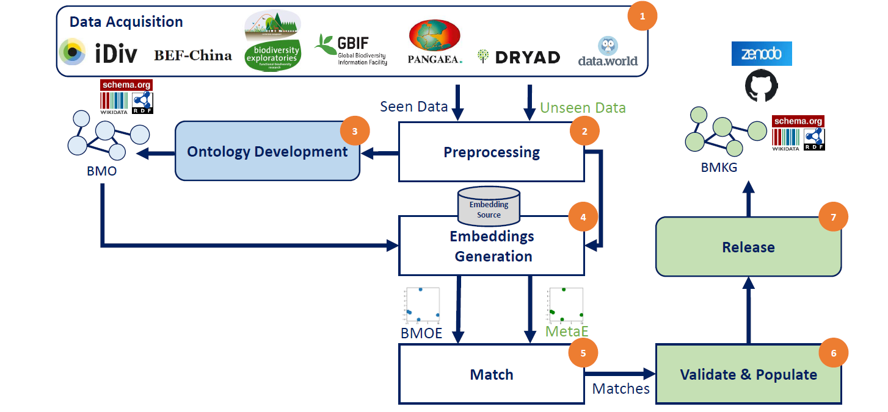

# Meta2KG
This project aims at the automatic transformation of metadata XML file to a knowledge graph. 
Such transformation is based on embedding-based similarity.
We developed and tested our approach on Biodiversity domain however, our approach is not limited to it.

This repository contains the scripts we developed our pipeline. In this file, we explain the framework then we continue on how to reproduce the results.

## Workflow
The figure below shows our 4 stages workflow. 
1. Data Acquisition: from 7 Biodiversity data portals we collected a set of metadata files. Such that we divided them into Seen and Unseen data.
2. Ontology Development: We work on the Seen Data, the goals of that stage are:
   * To develop a shared underlying schema for the 7 repos. The results is the [Biodiversity Metadata Ontology (BMO)](https://doi.org/10.5281/zenodo.6948519).
   * To Obtain the BMO embeddings that we use for the automatic transformation in the later steps. The results is the [Biodiversity Metadata Ontology Embeddings (BMOE)](https://doi.org/10.5281/zenodo.6951658)
3. Match & Populate: Where we apply the cosine similarity between the BMOE and the Unseen data embeddings. In addition, we provide a validation module that ensure the validity of a KG triple. 
   * We evaluated our approach using a manually annotated ground truth: [Biodiversity Metadata Ground Truth](https://doi.org/10.5281/zenodo.6951623)
4. Release: We publish the final automatically generated knowledge graph in Zenodo [Biodiversity Metadata Knowledge Graph (BMKG)](https://doi.org/10.5281/zenodo.6948573).

